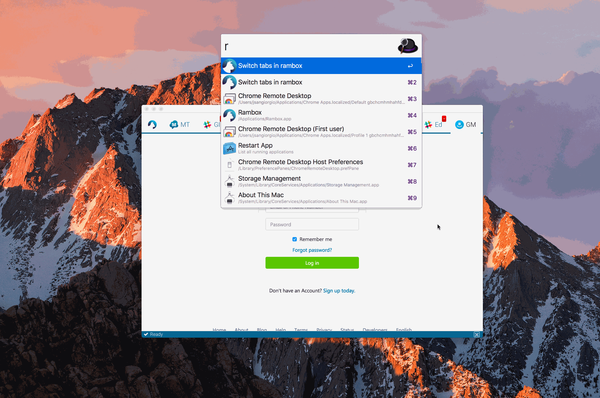
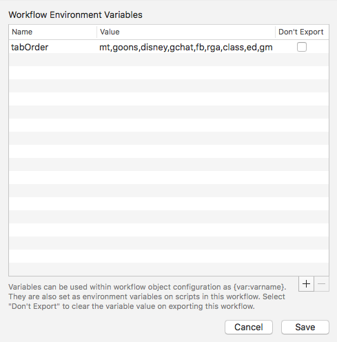

# Alfred Rambox Switcher 


> Switch tabs in Rambox




## Install

```
$ npm install --global alfred-rambox-switcher
```

*Requires [Node.js](https://nodejs.org) 6+ and the Alfred [Powerpack](https://www.alfredapp.com/powerpack/).*

Once installed, add a workflow environment variable called tabOrder to the workflow. This must be a comma-separated list without wrapping spaces.
It should match the order in which your Rambox tabs are arranged. See pictures below.   




## Usage

In Alfred, type `ram TAB_NAME` -- it will do a fuzzy search. Select the appropriate choice, and it will open inside Rambox.
Alternatively, type `r TAB_NAME` for the same feature.


## License

MIT © [Joseph Sangiorgio](http://joesangiorgio.com)